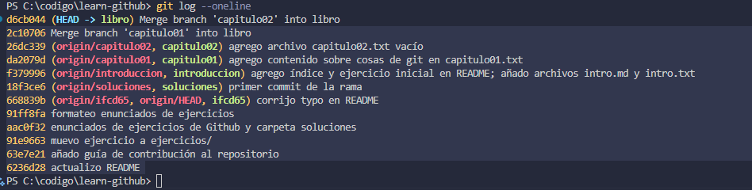
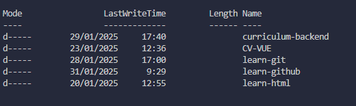

# learn-github

Repositorio para aprender Github paso a paso.

Crea un `Fork` para contribuir, más información: [cómo contribuir a este repositorio](CONTRIBUTING.md).

---

## Índice

- [Ejercicio 1](#ejercicio-1)
- [Ejercicio 2](#ejercicio-2)

---

### Ejercicio 1

1. Vamos a imaginar que trabajamos en un libro sobre Git y queremos hacer algunos temas. Se va a trabajar en ramas para cada capítulo. Implementa las siguientes **ramas** con al menos un archivo y un commit con cualquier contenido:

- `introduccion` -> intro.txt, intro.md...
- `capitulo01` -> capitulo01.txt...
- `capitulo02` -> capitulo02.txt...

Finalmente, vamos a fusionar todos estos contenidos en `libro`. El resultado debe ser algo como:

```
intro.txt
capitulo01.txt
capitulo02.txt
etc.
```

- `git log` debe mostrar los commits de cada rama más el commit de merge.

2. resolución

```bash
git checkout -b introduccion
echo "introduccion" > intro.txt
git add intro.txt
git commit -m "introduccion"
git checkout -b capitulo01
echo "capitulo01" > capitulo01.txt
git add capitulo01.txt
git commit -m "capitulo01"
git checkout -b capitulo02
echo "capitulo02" > capitulo02.txt
git add capitulo02.txt
git commit -m "capitulo02"
git checkout introduccion
git merge capitulo01
git merge capitulo02

```

3. Resultado del `git log --oneline`
   3.1 

---

## Ejercicio 2

### Objetivo:

Aprender a clonar un repositorio remoto en tu máquina local.

### Instrucciones:

1. Busca un repositorio público en GitHub que te interese o usa este repositorio de ejemplo:  
   `[URL_DEL_REPOSITORIO]`
2. Abre tu terminal y ejecuta el siguiente comando para clonar el repositorio en tu máquina local:
   ```bash
   git clone https://github.com/usuario/repo.git
   ```
3. Accede al directorio del repositorio clonado:
   ```bash
   cd repo
   ```
4. Verifica que la clonación fue exitosa listando los archivos del repositorio.

### Resultados:

1. Clonamos el repositorio de `cv_backend`.
   1.1 ```bash
   git clone [cv_backend](https://github.com/cdryampi/curriculum-backend.git)

   ```

   ```

2. Accedemos al directorio del repositorio clonado.
   2.1 ```bash
   cd curriculum-backend

   ```

   ```

3. Listamos los archivos del repositorio.
   3.1 ```bash
   dir

   ```

   ```

4. Resultado de la clonación.
   4.1 

---

## 3. Hacer un Fork de un repositorio

### Objetivo:

Aprender a hacer un **fork** de un repositorio para trabajar en una copia independiente.

### Instrucciones:

1. Busca un repositorio en GitHub que permita contribuciones y haz un **fork** del mismo.
2. Ve a tu perfil y verifica que el repositorio ahora aparece en tu cuenta.
3. Clona tu fork en tu máquina local con:

   ```bash
   git clone https://github.com/tu_usuario/nombre_del_fork.git
   ```

4. Confirma que has clonado el repositorio correcto verificando su origen con:

   ```bash
   git remote -v
   ```

### Resultados:

1. Hicimos un fork del repositorio `learn-github`.
   1.1 [Fork de learn-github](./src/img/ejercicio3.png)

2. Comprobamos que tenemos el repositorio correctamente y conectado en el remoto.

```bash
   PS C:\codigo\learn-github> git remote -v
   origin  https://github.com/cdryampi/learn-github.git (fetch)
   origin  https://github.com/cdryampi/learn-github.git (push)
```

---
